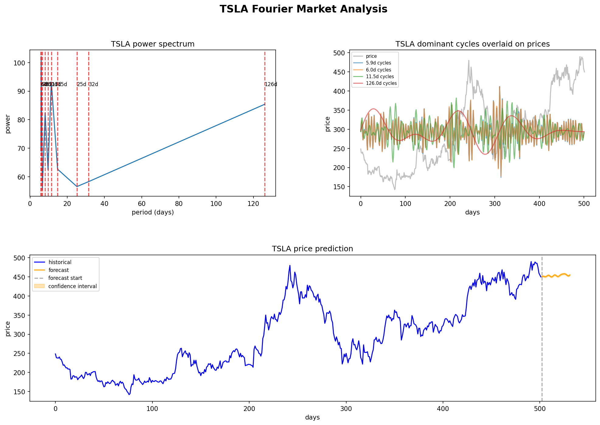
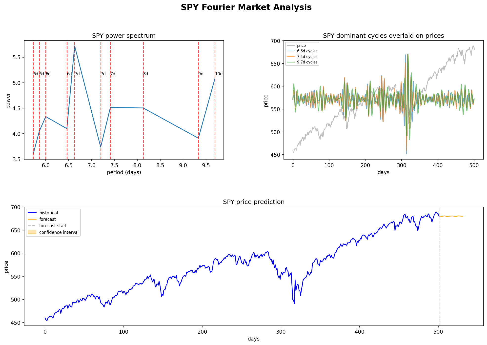
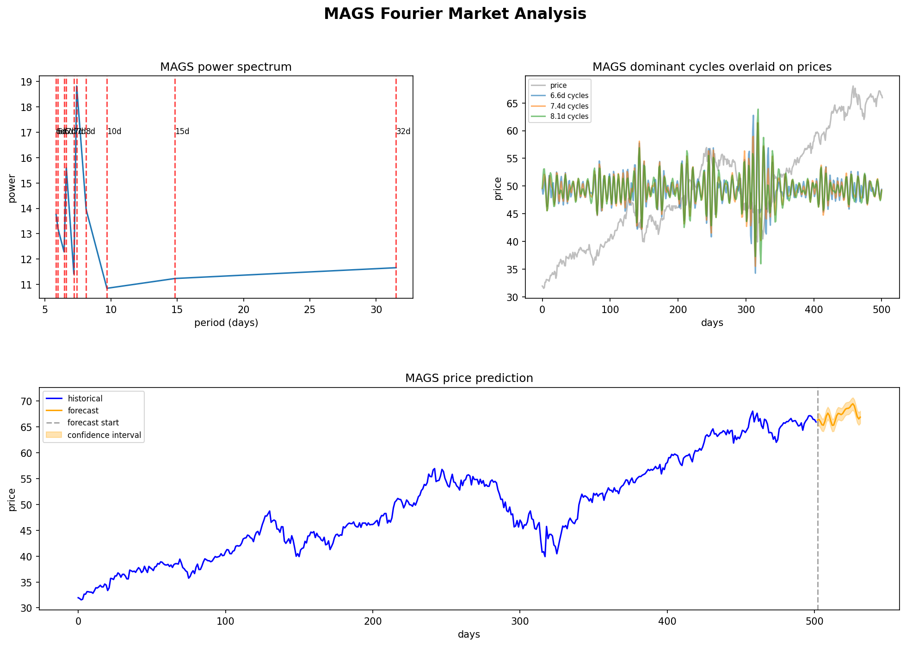

# Fourier Market Analysis

A signal processing tool that applies Fourier analysis to financial market data to detect
cyclical patterns in asset prices and extrapolate them as indicators of future price movement.

---

## What it does

This tool analyzes publicly tradeable financial assets for cyclical patterns in price 
progression. Upon detection, it extrapolates these patterns as potential indicators of 
future price movement, validates them through walk-forward backtesting, visualizes the 
results, and as a little easter egg — turns the market cycles into music.

---

## Methodology

**1. Data Pipeline**  
Historical closing prices are fetched via `yfinance` and cached locally as `.parquet` 
files to avoid redundant API calls. Daily log returns are computed from raw closing prices 
to ensure stationarity — a requirement for reliable Fourier analysis. Stationarity is 
formally verified using the Augmented Dickey-Fuller (ADF) test.

**2. Spectral Analysis**  
Rather than applying a raw Fast Fourier Transform, we use Welch's method — which splits 
the signal into overlapping windows, computes the FFT on each, and averages the results. 
This significantly reduces noise while preserving the dominant cyclical structure. Cycles 
shorter than 5 trading days are filtered out to focus on meaningful macro patterns rather 
than microstructure noise.

**3. Cycle Extraction**  
The top 10 most powerful cycles are extracted from the power spectrum. Each cycle is 
isolated using a bandpass filter (Butterworth, order 3, zero-phase via `filtfilt`) centered 
at the cycle's frequency with a configurable bandwidth. All parameters are tunable via 
`config.py`.

**4. Prediction**  
A sine wave is fitted to each extracted cycle using nonlinear least squares regression 
(`scipy.optimize.curve_fit`). The fitted function is extrapolated forward over a 
configurable forecast window. Individual cycle forecasts are summed — mirroring the 
inverse Fourier transform — to produce a single combined price prediction.

**5. Backtesting**  
A walk-forward backtesting framework validates prediction accuracy across historical data. 
A sliding window runs the full analysis pipeline at each step, makes a directional 
prediction, and compares it to the observed price movement. Hit rate is computed over 
all trades.

**6. Visualization**  
Results are visualized in a three-panel dashboard per ticker:
- Power spectrum with dominant cycle markers
- Top 3 cycles overlaid on historical price
- Historical price with forecast and confidence interval

---

## Results

Three tickers were chosen to represent different market personalities:
- **TSLA** — high volatility, sentiment-driven individual stock
- **SPY** — S&P 500 index fund, maximum diversification and noise
- **MAGS** — Magnificent 7 ETF, concentrated mega-cap tech exposure





| Ticker | Signal | Avg Daily Return | Backtest Hit Rate | Trades |
|--------|--------|-----------------|-------------------|--------|
| TSLA   | UP     | +0.1675%        | 60.0%             | 220    |
| SPY    | UP     | +0.0034%        | 19.5%             | 220    |
| MAGS   | UP     | +0.0311%        | 74.1%             | 220    |

**TSLA (60.0%)** — A strong semi-annual cycle (~126 trading days) was detected, likely 
corresponding to earnings report cycles. This consistent rhythm gives the model a 
detectable edge.

**SPY (19.5%)** — Performance worse than random. SPY is the most heavily analyzed 
instrument in the world — any cyclical patterns are rapidly arbitraged away by algorithmic 
traders, consistent with the Efficient Market Hypothesis. The model's systematic 
underperformance on SPY is itself a meaningful result.

**MAGS (74.1%)** — Exceptional hit rate, likely because the Magnificent 7 companies share 
synchronized cycles driven by correlated macro forces (AI sentiment, Fed rates, earnings 
calendars). However, overfitting cannot be ruled out given the algorithm does not account 
for the many extraneous factors of the market. Treat this result with appropriate skepticism.

> **Disclaimer:** This tool is for research and educational purposes only. It is not 
> financial advice. Past cyclical patterns do not guarantee future performance.

---

## Installation

```bash
git clone https://github.com/yourname/fourier-market-analysis
cd fourier-market-analysis
python -m venv venv
source venv/bin/activate
pip install -r requirements.txt
```

---

## Usage

Edit `config.py` to configure your tickers, date range, and analysis parameters:

```python
TICKERS = ["TSLA", "SPY", "MAGS"]
START_DATE = "2022-01-01"
END_DATE   = "2026-01-01"
FORECAST_DAYS = 30
MIN_PERIOD    = 5
TOP_N_CYCLES  = 10
```

Then run the full pipeline from the project root:

```bash
python main.py
```

Outputs are saved to `output/`:
- `{TICKER}_dashboard.png` — three panel analysis dashboard
- `{TICKER}_market_music.wav` — sonification audio

---

## "Can you hear the music?"

*Inspired by Oppenheimer.*

Every market has a rhythm. This tool maps the dominant cycles detected in each asset 
directly to audible frequencies using logarithmic scaling — mirroring how human pitch 
perception works. Cycle power maps to amplitude, so stronger market rhythms play louder.

The result is a unique audio fingerprint for each asset. TSLA's dominant semi-annual 
cycle produces a deep, slow-moving tone beneath the noise. SPY sounds like static — 
no cycle dominates, everything cancels. MAGS sits somewhere in between.

The audio files are saved automatically when you run `main.py`. Put on headphones.
PS they sound like the cries of unfortunate retail traders

---

## Project Structure

```bash
fourier-market-analysis/
├── data/               # cached parquet files
├── output/             # dashboards and audio
├── src/
│   ├── fetcher.py      # data pipeline + stationarity testing
│   ├── analysis.py     # Welch PSD + cycle extraction + bandpass filtering
│   ├── predictor.py    # sine fitting + extrapolation + combined forecast
│   ├── backtester.py   # walk-forward validation
│   ├── sonification.py # market cycles → audio
│   └── dashboard.py    # matplotlib visualization
├── main.py             # entry point
├── config.py           # all tunable parameters
└── requirements.txt
```

---

## Limitations & Future Work

- Cycle stationarity is assumed — real market regimes shift over time
- Sine wave fitting assumes clean periodicity that financial data rarely exhibits perfectly  
- No transaction costs or slippage modeled in backtesting
- Future: rolling window cycle detection, regime change detection, multi-asset correlation analysis
